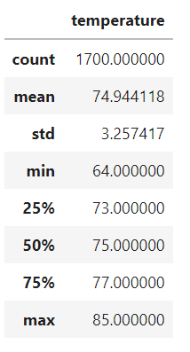
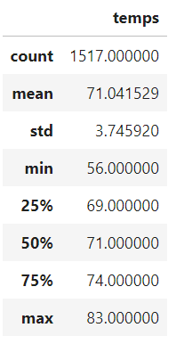

# Module 9 | Assignment - Surfs Up

# Overview of the analysis: 
We are going to analyse climate data using Python, SQLAlchemy, Pandas, and Matplotlib.

## Results: 
After summarizing the data using describe, we find out that:
-   June: The average temperature was ~75F with a large variation from 64F to 85F during the month.   

-   December: The average temperature was ~71F with an even large variation from 56F to 83F during the month.   

-   Majority of obersvations were between 73F and 77F for June and 69F and 74F for December.

## Summary: 
Based on the results, it seems that June will be a better month for ice cream and surfing business.

Here are 2 recommendations for additional analysis:
1. Check temperatures for other months:
    results = session.query(Measurement.date, Measurement.tobs).filter(extract('month', Measurement.date)=='enter month').all()
2. Check other weather observations like wind speed humidity.
    results = session.query(Measurement.date, Measurement.hum).filter(extract('month', Measurement.date)==6).all()